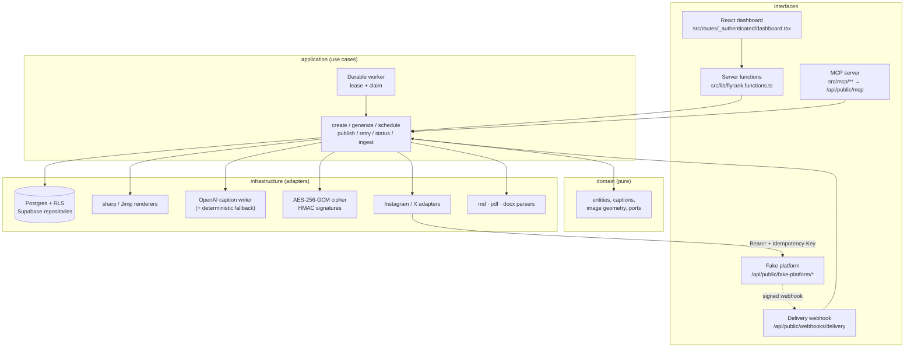

# CampaignHub Studio

**Transform a single blog post into a complete multi-platform social campaign.**

CampaignHub Studio is the reference implementation of the *FlyRank capstone*: given a
published post (title + body + URL), it generates per-platform image variants and
platform-tailored captions, then publishes them — immediately or on a schedule — through a
unified adapter interface, with idempotency, `Retry-After` handling, encrypted OAuth tokens,
signature-verified delivery webhooks and a crash-safe worker.

> **No real social API is ever called.** All publishing goes to an in-repo fake platform.
> Verified by a test: `tests/security.test.ts › no real social platform is ever called`.

---

## Table of contents

1. [Overview](#overview)
2. [Architecture](#architecture)
3. [Features](#features)
4. [Technology stack](#technology-stack)
5. [Installation](#installation)
6. [Environment setup](#environment-setup)
7. [Running locally](#running-locally)
8. [API overview](#api-overview)
9. [Project structure](#project-structure)
10. [Testing](#testing)
11. [Demo walkthrough](#demo-walkthrough)
12. [Design decisions](#design-decisions)
13. [Limitations](#limitations)
14. [Future work](#future-work)

---

## Overview

A campaign is created from one blog post. The engine then:

1. **Ingests content** — paste text, upload `.md` / `.pdf` / `.docx`, or pick a real published
   article from the built-in **Blog library** (Anthropic, Google DeepMind, Cloudflare feeds,
   enriched with Open Graph metadata).
2. **Generates one `SocialPostEntry` per platform** (Instagram, X) with a tailored caption and
   a real PNG image variant at exact platform dimensions.
3. **Publishes** each entry through a `SocialPublisher` adapter that speaks to the fake
   platform with a deterministic `Idempotency-Key`, honouring `429 Retry-After`.
4. **Confirms delivery** only when an HMAC-signed webhook arrives — the sole writer of the
   terminal `published` / `failed` state.

Captions are written by an LLM (OpenAI `gpt-4o-mini`) using the shared brand-voice +
platform-fragment prompt architecture, with an automatic, silent fall back to the
deterministic composer whenever the LLM is unavailable. Campaign creation never fails
because of the model.

## Architecture

Clean Architecture with a strict inward dependency rule: `interfaces → application → domain`.
No use case imports Postgres, `sharp`, `fetch` or the OpenAI SDK — only ports.



**Layer rules**

| Layer | May import | Never imports |
| --- | --- | --- |
| `src/domain` | nothing but config + itself | I/O of any kind |
| `src/application` | `src/domain` (ports) | Supabase, sharp, fetch, OpenAI |
| `src/infrastructure` | domain ports it implements | application, interfaces |
| `src/routes`, `src/mcp` | application use cases | infrastructure internals |

Adding LinkedIn = one platform spec + one voice block + one adapter + one registry line.

## Features

- **Content ingestion** — paste, `.md`, `.pdf` (`unpdf`), `.docx` (`mammoth`), or the curated
  blog library with source filters, real article imagery and text previews.
- **Per-platform image variants** — real PNG bytes at Instagram `1080×1080` and X `1600×900`,
  produced by `sharp` (native runtime) or `Jimp` (serverless), from one shared pure-geometry
  composition with safe-zone enforcement.
- **Platform-tailored captions** — LLM-written from shared brand voice + per-platform
  fragments; deterministic composer as fallback. Brand name and brand tone are optional
  campaign inputs.
- **Unified publisher interface** — `SocialPublisher` port, two fake adapters; application code
  never names a transport.
- **Idempotency** — deterministic key `flyrank:{campaignId}:{platform}`, enforced by a unique DB
  constraint *and* by the fake platform. Publish twice, retry after a timeout → one post.
- **Rate limiting** — `429` + `Retry-After` honoured, exponential backoff floor, capped attempts,
  every attempt recorded in `publish_attempts`.
- **Durable scheduling** — due rows claimed with a short `lease_until`; a crashed worker's claims
  expire and are replayed under the same idempotency key → zero duplicates.
- **Signed delivery webhooks** — Stripe-style `t=…,v1=…` HMAC-SHA256, replay window,
  timing-safe compare. Forged → `400`, state unchanged.
- **Encrypted OAuth tokens** — AES-256-GCM, fresh random IV per write, redaction helper for logs,
  no plaintext token column anywhere.
- **Multi-tenant auth** — email/password + Google, every row scoped by `user_id` under RLS.
- **Campaign management UI** — dark/light dashboard, live status timeline, manual caption
  editing, optimistic delete with a 10-second undo toast, demo control rail.
- **Standalone MCP server** — vendor-neutral JSON-RPC MCP interface over the same use cases.

## Technology stack

| Concern | Choice |
| --- | --- |
| Language | TypeScript (strict) |
| Framework | TanStack Start v1 (React 19, Vite 7), file-based routing + server functions |
| Data | Postgres (Lovable Cloud / Supabase) with RLS, SQL migrations |
| Storage | Private bucket for generated PNGs, per-user paths |
| Imaging | `sharp` (primary) / `jimp` (serverless fallback) |
| Parsing | `unpdf`, `mammoth` |
| AI captions | OpenAI `gpt-4o-mini` via the prompt-fragment config |
| Validation | `zod` at every boundary |
| Crypto | Node `crypto` — AES-256-GCM, HMAC-SHA256 |
| UI | Tailwind CSS v4, shadcn/ui, sonner |
| Tests | Vitest |
| MCP | Hand-rolled JSON-RPC 2.0 server, depends only on `zod` + `zod-to-json-schema` |

## Installation

```bash
git clone <repository-url>
cd campaignhub-studio
bun install         # or: npm install
```

Requires Node.js 20+ (or Bun 1.1+).

## Environment setup

```bash
cp .env.example .env
```

Every variable and its purpose is documented in `.env.example`. Nothing is strictly required
in the sandbox — missing `TOKEN_ENCRYPTION_KEY` / `WEBHOOK_SIGNING_SECRET` fall back to
clearly labelled dev values, and a missing `OPENAI_API_KEY` simply routes caption generation
to the deterministic composer. Generate real secrets with `openssl rand -hex 32` before any
deployment. `.env` is git-ignored and contains no committed secrets.

Database: apply `supabase/migrations/*.sql` in order (or `supabase/flyrank-full-schema.sql`
as a single script) to your Postgres project. The schema creates every table with explicit
`GRANT`s, RLS policies and indexes.

## Running locally

```bash
bun run dev        # http://localhost:8080
bun run test       # vitest
bun run lint
bun run build
```

Sign up on `/auth`, then land on `/dashboard`.

## API overview

The dashboard talks to the server through typed server functions
(`src/lib/flyrank.functions.ts`), not REST — one transport, one auth path, no hand-written
fetch layer:

| Server function | Purpose |
| --- | --- |
| `listPosts`, `createPostFromText`, `createPostFromUpload`, `deletePost` | content library CRUD |
| `listBlogLibrary`, `createCampaignFromLibrary` | curated published-post feed |
| `createCampaignWithAssets` | create campaign + captions + image variants |
| `updateCampaignFn`, `deleteCampaignFn` | manual edits, deletion |
| `regenerateCaptions`, `regenerateImages` | regenerate assets |
| `scheduleCampaignFn`, `publishCampaignFn`, `retryCampaignFn` | lifecycle |
| `loadDashboard` | campaigns, entries, attempts, webhook events, worker state |
| `tickWorker`, `setPlatformRateLimit` | demo controls (force 429, run a worker tick) |

Public HTTP routes (external callers, no session):

| Method | Path | Purpose |
| --- | --- | --- |
| `POST` | `/api/public/fake-platform/$platform/posts` | **fake** publish: Bearer auth, idempotency, 429/Retry-After, async signed webhook |
| `GET` | `/api/public/fake-platform/$platform/posts` | inspect fake-platform state |
| `POST` | `/api/public/webhooks/delivery` | signed delivery webhook — only writer of terminal status |
| `POST` | `/api/public/mcp` | MCP JSON-RPC endpoint (`initialize`, `tools/list`, `tools/call`) |
| `GET` | `/.well-known/oauth-protected-resource` | RFC 9728 discovery for MCP clients |

All inputs are validated with zod; invalid input returns `400` with the issue list, never a 500.

### MCP tools

`create_campaign`, `list_campaigns`, `get_campaign`, `campaign_status`, `schedule_campaign`,
`publish_campaign`, `retry_campaign` — each a thin delegate to a use case in `src/application/`.
The MCP layer holds no business logic, writes no captions and calls no model. Authenticate with
`Authorization: Bearer <access token>`; every query runs under the caller's RLS scope. Consent
screen: `/oauth/consent`.

## Project structure

```
src/
  domain/                      pure core — zero I/O
    entities.ts                BlogPost, Campaign, SocialPostEntry, idempotency key,
                               backoff, status derivation
    captions.ts                deterministic caption composer
    image-composition.ts       crop geometry, safe-zone fit, SVG composition
    ports.ts                   repository / publisher / renderer / parser interfaces
  application/                 use cases, depend only on ports
    campaign-usecases.ts       create, generate captions + images, edit, delete
    publish-usecases.ts        publish, retry, idempotency, 429 backoff, attempts
    delivery-usecases.ts       signed webhook ingestion → terminal status
    worker.ts                  durable lease/claim scheduler
    ingest-content.ts          paste / md / pdf / docx normalisation
    import-library-post.ts     curated blog-library import
  infrastructure/              adapters (the only place with I/O)
    persistence/supabase-repositories.server.ts
    publishing/adapters.server.ts, fake-platform-transport.server.ts
    imaging/renderers.server.ts        sharp + Jimp
    parsing/document-parser.server.ts  unpdf + mammoth
    crypto/token-cipher.server.ts, webhook-signature.server.ts
    ai/openai-caption-writer.server.ts
    feeds/blog-library.server.ts
    storage/image-store.server.ts
    context.server.ts          composition root (dependency injection)
  interfaces
    routes/                    dashboard, auth, OAuth consent, public API routes
    mcp/                       JSON-RPC server + 7 tool delegates
    components/campaign/       composer, variant cards, status chips, edit dialog
  config/                      platform specs, prompt fragments
supabase/migrations/           schema, grants, RLS, indexes
tests/                         vitest suites
```

## Testing

```bash
bun run test
```

| Suite | Covers |
| --- | --- |
| `tests/domain.test.ts` | exact per-platform geometry, safe-zone containment, aspect ratio, caption divergence/limits/hashtag budget/determinism, idempotency key, `Retry-After` vs exponential backoff, campaign status derivation |
| `tests/imaging.test.ts` | real PNG bytes decoded from the IHDR chunk at `1080×1080` and `1600×900` |
| `tests/security.test.ts` | AES-256-GCM round-trip, fresh IV per write, auth-tag tamper rejection, log redaction, webhook signature accept/forge/tamper/replay, repo-wide scan proving no real platform endpoint is referenced |

Behaviours that need a live database and worker (duplicate publish → one post, crash-resume,
forged webhook → `400`) are exercised through the dashboard demo rail; see
[EVIDENCE.md](./EVIDENCE.md) for the reviewer walkthrough of each one.

## Demo walkthrough

1. **Create** — pick an article in the Blog library (or paste/upload one) → *Generate campaign*.
   Square `1080×1080` and wide `1600×900` variants render side by side with two visibly
   different captions (X: one idea + link, ~180 chars; Instagram: hook, story, sign-off, up to
   8 hashtags).
2. **Schedule** — set a time in the future, then run a worker tick from the demo rail; the
   status chips flip `queued → publishing`.
3. **Idempotency** — hit *Publish now* repeatedly; `GET /api/public/fake-platform/x/posts`
   still holds exactly one post per platform.
4. **Rate limiting** — *Force 429 ×2* → publish → the attempts drawer shows the rate-limited
   attempts with the honoured `Retry-After`, then success.
5. **Webhooks** — a forged webhook returns `400` and changes nothing; the genuine signed
   webhook flips the entry to **Published**.
6. **Crash safety** — interrupt mid-publish and tick again: the expired lease is reclaimed and
   the same idempotency key collapses the replay into the original post.

## Design decisions

Full rationale in [DECISIONS.md](./DECISIONS.md); the highlights:

- **TanStack Start server functions instead of Express/Fastify** — the app is already a
  TanStack Start project; a second HTTP process would add a deploy target and CORS for no gain.
- **Postgres + RLS instead of a local file/SQLite store** — tenant isolation is a graded
  requirement, and the lease/claim scheduler wants real transactional `UPDATE`s.
- **`sharp` primary, `Jimp` fallback, no custom PNG encoder** — the deployment target is a
  Worker where sharp's native binary cannot load; shared pure geometry keeps both paths
  byte-identical in dimensions.
- **Deterministic idempotency keys** — a random key would make a post-crash replay look like a
  new publish.
- **Webhook-owned terminal status** — with one documented exception: after `MAX_PUBLISH_ATTEMPTS`
  with no platform acceptance, no webhook will ever arrive, so the worker marks `failed` locally.
- **LLM captions with deterministic fallback** — quality when the model is available,
  availability when it is not.
- **MCP as an interface, not a feature** — every tool delegates to an existing use case.

## Limitations

- The fake platform's memory is process-local by design; it is a test double, not the system
  under test.
- The image composition is generated artwork (gradient + subject + typography) driven by the
  post, not a photo pipeline — the graded behaviour is geometry, dimensions and safe zones.
- PDF extraction is text-only; scanned/image PDFs yield no body text.
- Blog-library enrichment scrapes public Open Graph metadata and depends on those sites staying
  reachable; failures degrade to title-only previews.
- Only Instagram and X are implemented (the two platforms the capstone requires).
- LLM caption quality varies by model availability; the fallback is intentionally plainer.

## Future work

Within the capstone scope, and explicitly **not started** (all stretch goals per the brief):
real-platform integration, brand templating, A/B captions, analytics loopback and an approval
workflow. Anything beyond that is out of scope for this submission.

## License

[MIT](./LICENSE)
