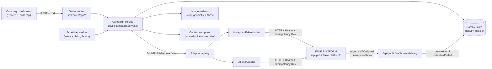

# FlyRank — Multi-Platform Social Campaign Engine

Turn one published blog post into per-platform image variants and platform-tailored
captions, then publish immediately or schedule it through a durable, idempotent worker.

**Everything runs against an in-repo fake platform. No real social API is ever called.**
(`grep -rniE "graph\.facebook|api\.twitter|api\.x\.com|instagram\.com|twitter\.com" src tests` → no matches.)

---

## Quick start

```bash
bun install
cp .env.example .env      # optional in the sandbox; dev fallbacks are used when unset
bun run dev               # http://localhost:8080
bun run test              # unit + e2e (e2e skips itself if the dev server is down)
```

## Demo script (clickable)

1. Pick a blog post → **Make campaign** → square 1080×1080 and wide 1600×900 variants
   render side by side with two visibly different captions (X: one idea + link, ~180 chars;
   Instagram: hook, story, sign-off, 8 hashtags, ~600 chars).
2. **Schedule +10m**, then **Advance clock +10m** in the dev panel → the worker picks the
   rows up and the status chips flip.
3. Click **Publish now** repeatedly → the fake platform still holds exactly one post per
   platform (idempotency key), visible at `GET /api/public/fake-platform/publish`.
4. **Force 429 ×2** → publish → the worker log shows the rate-limit and the honoured
   `Retry-After` backoff, then success.
5. **Fire forged webhook** → 400, no state change (webhook log shows the rejection) →
   **Fire valid webhook** → status flips to Published.
6. Campaign view is all green; zero real accounts touched.

## Architecture



### Why TanStack Start server routes instead of Express/Fastify
The app is already a TanStack Start project; its file-based server routes are plain
`Request → Response` handlers with the same shape a Fastify handler has. Adding a second
HTTP process would mean two deploy targets and CORS for no functional gain. See
`DECISIONS.md` (D1) — porting to Fastify is mechanical if the team ever wants it.

## Layout

```
src/config/platform-specs.ts        Wk3 — image sizes, aspect ratios, safe zones, limits
src/config/social-prompts.config.ts Wk3 — shared brand voice + per-platform overrides
src/lib/types.ts                    Wk3 — SocialPostEntry / ContentSocials data model
src/lib/image-variants.ts           Wk5 — crop geometry, safe-zone fit, SVG renderer
src/lib/captions.ts                 Wk5 — (post, platform) -> tailored caption
src/lib/publisher/types.ts          Wk3 — the SocialPublisher interface (the only seam)
src/lib/publisher/adapters/*        Wk6/7 — fake transport, Instagram + X adapters
src/lib/crypto.server.ts            Wk6/7 — AES-256-GCM token encryption (random IV)
src/lib/webhook-signature.server.ts Wk8 — Stripe-style HMAC sign/verify
src/lib/campaign.server.ts          business logic: create, claim, publish
src/lib/worker.server.ts            Wk8 — durable, resumable scheduling worker
src/lib/store.server.ts             durable JSON-file store (queue table equivalent)
src/routes/api/**                   REST API, fake platform, webhook, image, dev panel, MCP
src/components/campaign/*           dashboard UI
tests/*                             unit + end-to-end suites
```

## API

| Method | Path | Purpose |
| --- | --- | --- |
| GET | `/api/posts` | Blog posts + generated preview (captions/images) |
| GET/POST | `/api/campaigns` | List campaigns / create (optionally scheduled) |
| GET | `/api/campaigns/$postId` | Campaign status |
| POST | `/api/campaigns/$postId/publish` | Publish now |
| POST | `/api/campaigns/$postId/schedule` | Schedule / reschedule (`scheduledFor` ISO) |
| GET | `/api/logs` | Worker + webhook logs, dev-clock state |
| POST | `/api/dev` | Dev panel: `force429`, `advanceClock`, `tick`, `sendWebhook`, `reset` |
| POST | `/api/public/fake-platform/oauth/token` | **Fake** OAuth token issuance |
| GET/POST | `/api/public/fake-platform/publish` | **Fake** publish (429 / idempotency / async webhook) |
| POST | `/api/public/webhooks/delivery` | Signed delivery webhook (only writer of terminal status) |
| GET | `/api/image/variant?platform&seed&title` | Rendered variant at exact platform dimensions |
| POST | `/api/public/mcp` | Standalone MCP server (JSON-RPC, bearer-authenticated) |

All request bodies are validated with zod; invalid input returns `400` with the issue list.

## Guarantees and how they are proven

| Guarantee | Mechanism | Test |
| --- | --- | --- |
| Exact per-platform dimensions, subject in safe zone | `computeVariantGeometry` / `fitSubjectToSafeZone` | `tests/image-variants.test.ts` |
| Captions differ in structure, tone, length, hashtag budget | fragment composition, not truncation | `tests/captions.test.ts` |
| One post per (post, platform), however often you retry | deterministic `Idempotency-Key` + fake-platform dedupe | `tests/e2e-campaign.test.ts` |
| `429` honoured with `Retry-After` backoff | adapter retry loop | `tests/e2e-campaign.test.ts` |
| Crash mid-batch resumes without double-posting | lease + claim in the durable store | `tests/worker-crash-resume.test.ts` |
| Forged webhook rejected `400`, no state change | HMAC + timestamp tolerance + timing-safe compare | `tests/security.test.ts`, `tests/e2e-campaign.test.ts` |
| Tokens encrypted at rest, fresh IV per write | AES-256-GCM | `tests/security.test.ts` |

## Adapter boundary

Application code imports **only** `getPublisher()` and the `SocialPublisher` interface.
`src/lib/publisher/adapters/**` is the only place allowed to perform platform I/O — a
folder boundary documented at the top of `src/lib/publisher/types.ts`. Adding LinkedIn means
one new spec, one voice block, one adapter file and one registry line.

## MCP server (standalone)

`POST /api/public/mcp` speaks the Model Context Protocol over JSON-RPC
(`initialize`, `tools/list`, `tools/call`) and is framework- and vendor-neutral:
the whole implementation lives in `src/mcp/` and depends only on `zod`.

Tools: `create_campaign`, `list_campaigns`, `get_campaign`, `campaign_status`,
`schedule_campaign`, `publish_campaign`, `retry_campaign`. Each one delegates to
an existing use case in `src/application/` — the MCP layer holds no business
logic, generates no captions and never calls a model itself.

Auth: send `Authorization: Bearer <access token>`. The token is verified against
the auth server and every query runs under the caller's RLS scope. Clients can
discover the authorization server at `/.well-known/oauth-protected-resource`;
the OAuth consent screen is `/oauth/consent`.

## Environment

See `.env.example`. Nothing is required to run the sandbox: missing
`TOKEN_ENCRYPTION_KEY` / `WEBHOOK_SIGNING_SECRET` fall back to clearly-labelled dev values.
Set real values (`openssl rand -hex 32`) before any deployment. `.env` is git-ignored.

## Out of scope

All stretch goals (real-platform integration, brand templating, A/B captions, analytics
loopback, approval workflow) are intentionally not started. See `DECISIONS.md`.
